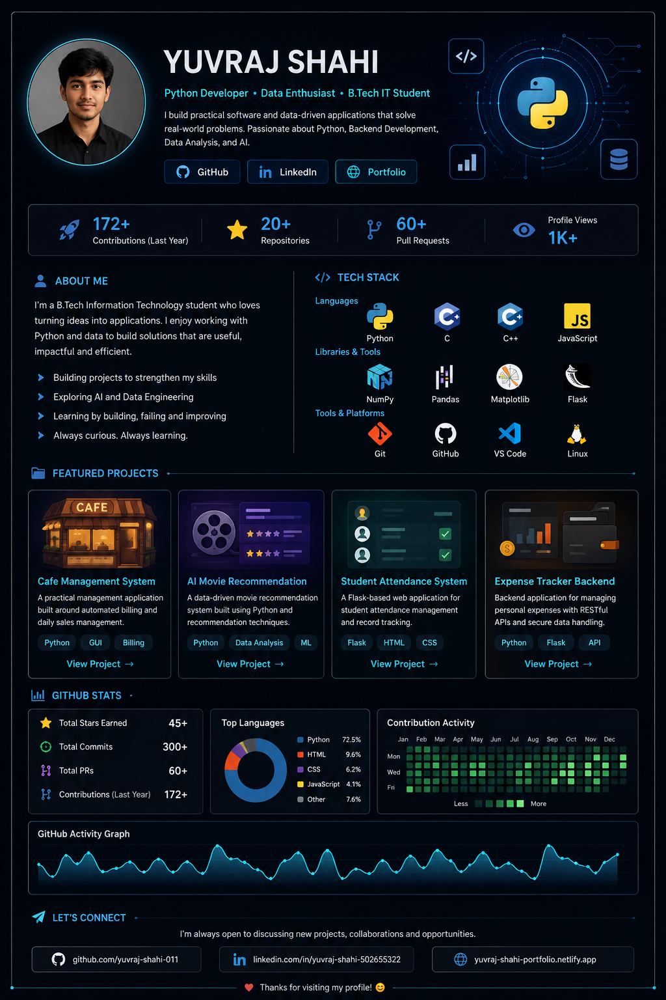

# Yuvraj Shahi

## 🔗 Connect

  <a href="https://github.com/yuvraj-shahi-011">GitHub</a> •
  <a href="https://www.linkedin.com/in/yuvraj-shahi-502655322/">LinkedIn</a> •
  <a href="https://yuvraj-shahi-portfolio.netlify.app/">Portfolio</a>

---

### About

B.Tech Information Technology student focused on Python development,
data analysis, backend development, AI, and data engineering.

### Featured Projects

- [Cafe Management System](https://github.com/yuvraj-shahi-011/Cafe-Management-System)
- [AI Movie Recommendation](https://github.com/yuvraj-shahi-011/AI-Movie-Recommendation)
- [Student Attendance System](https://github.com/yuvraj-shahi-011/student-attendance-system)
- [Expense Tracker Backend](https://github.com/yuvraj-shahi-011/expense-trackerbackend)